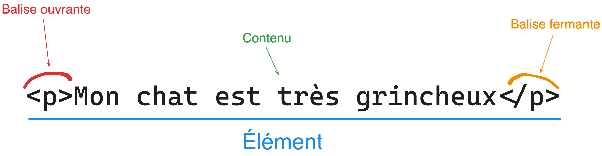

# Introduction au HTML

**HTML** signifie **"HyperText Markup Language"** qu'on peut traduire par "langage de balises pour l'hypertexte". Il est utilisé afin de créer et de représenter le contenu d'une page web et sa structure.

# Histoire

**HTML** est une des trois inventions à la base du **World Wide Web**, avec le **Hypertext Transfer Protocol (HTTP)** et les **adresses web (URL)**.

## Projet ENQUIRE (1980)

L'idée de l'hypertexte, qui permet de lier des documents électroniques entre eux, remonte au projet ENQUIRE de Sir Tim Berners-Lee en 1980. Bien que ce projet n'ait pas abouti à un produit final, il a jeté les bases conceptuelles de ce qui allait devenir le **World Wide Web**.

## Proposition de Tim Berners-Lee (1989)

En 1989, Tim Berners-Lee, un physicien britannique travaillant au CERN, a proposé un système de gestion de l'information basé sur des documents hypertextes. Il a esquissé la première vision du langage qui allait devenir HTML.

## Première spécification HTML (1991)

En 1991, Tim Berners-Lee a publié la première spécification du HTML, qui comprenait 18 éléments (balises) pour structurer le contenu.

## HTML+ et HTML 2.0 (1995)
L'évolution rapide du Web a conduit à des versions améliorées du HTML. HTML+ a été proposé comme une extension, suivi par HTML 2.0, qui introduisait des éléments tels que les formulaires et les tables.

## HTML 3.2 et 4.01 (1997-1999)

Ces versions ont apporté des fonctionnalités avancées, telles que les cadres et les feuilles de style. HTML 4.01, publié en 1999, a établi la norme pendant de nombreuses années.

## XHTML (2000)

L'XML (eXtensible Markup Language) a été introduit dans HTML, créant ainsi XHTML (eXtensible HyperText Markup Language). C'était une version plus stricte d'HTML, compatible avec XML.

## HTML5 (2008-à nos jours)

Le développement de HTML5 a commencé en 2004 et a impliqué la collaboration de nombreuses parties prenantes de l'industrie du Web. En 2008, le groupe de travail HTML de la W3C a publié le premier brouillon de la spécification HTML5. Cette version a introduit de nombreuses fonctionnalités, notamment la prise en charge native de l'audio et de la vidéo, des améliorations de la sémantique, et une meilleure gestion des formulaires.

# Structure de base d'une page HTML

Voici une structure de base d'un document HTML :

```html
<!DOCTYPE html>
<html lang="en">
<head>
    <meta charset="UTF-8">
    <meta name="viewport" content="width=device-width, initial-scale=1.0">
    <title>Document</title>
</head>
<body>
    
</body>
</html>
```

Vous pouvez créer un fichier html en définissant l'extension `.html`, par exemple : `index.html`, et y copier/coller le code ci-dessus.

## Ce qu'il y a dans ce document :

1. `<!DOCTYPE html>` : Cette déclaration est une **information** pour le navigateur sur le type de document auquel il doit s'attendre. Elle doit être la première ligne de tout document HTML. (Elle n'est pas cosidéré comme une balise HTML)

2. `<html lang="en">` : Cette balise ouvre et ferme l'élément racine du document HTML. L'attribut `lang` est utilisé pour spécifier la langue du document, ici en anglais ("en" pour l'anglais).

3. `<head>` : Cette balise englobe les éléments du document qui fournissent des informations sur le document lui-même, mais qui ne sont pas directement affichés dans le navigateur. **Cela inclut les métadonnées, les liens vers des feuilles de style (CSS), des scripts, et le titre du document.**

4. `<meta charset="UTF-8">` : Cet élément spécifie l'encodage des caractères pour le document. Ici, il est défini sur **"UTF-8"**, qui prend en charge la plupart des caractères du monde.

5. `<meta name="viewport" content="width=device-width, initial-scale=1.0">` : Cette balise est utilisée pour configurer la vue du port (viewport) du navigateur. Elle est particulièrement importante pour les sites web réactifs (responsive), car elle s'assure que la largeur du viewport correspond à la largeur de l'appareil et que l'échelle initiale est fixée à 1.0. (**Le "responsive" est la capacité à une page de s'adapter aux différents formats d'écrant**).

6. `<title>Document</title>` : C'est ici que vous définissez le titre du document, qui apparaîtra dans l'onglet du navigateur ou dans d'autres contextes lorsque le document est référencé.

7. `<body>` : Cette balise englobe le contenu réel du document HTML qui sera affiché dans le navigateur. C'est là que vous placerez le texte, les images, les liens **et tout autre élément visible sur la page**.

8. `</html>` : Ferme l'élément HTML, marquant la fin du document.


# Ajoutons du contenu à cette page blanche

Bon, si on tente d'afficher la page, rien n'aparaît.

Si vous faite un clique droit, puis **"Inspecter"**, vous devriez reconaître notre document HTML dans **l'inspecteur**.

Maintenant mettez à jour votre document :

```html
<!DOCTYPE html>
<html lang="en">
<head>
    <meta charset="UTF-8">
    <meta name="viewport" content="width=device-width, initial-scale=1.0">
    <title>Hello World</title>
</head>
<body>
    <h1>Hello World</h1>
    <p>Bienvenu chez les devs</p>
</body>
</html>
```

Pour voir les mises à jour sur votre votre document s'appliquer, il vous faut rafraichir la page.

# Obtenir des mises à jour automatiquement

Si vous avez installé l'extension Live Server, une option intitulée **"Go Live"** en bas à droite de votre éditeur de code (Visual Studio Code) est apparu, cliqué dessus pour lancer un serveur local, aller sur votre navigateur et mettez-y l'URL suivant : http://localhost:5500/

À cette address, vous retrouverez votre page HTML.

Lors ce que vous mettrez à jour votre fichier HTML, automatiquement, votre page, sur le navigateur, sera à jour.

# Balises en paires et balises orphelines

En HTML, une balise se présente comme suite : `<body>`.

## Balises en paires

Les balises en paires sont toujours par deux :
```html
<body>
    <p>Element entre deux balises</p>
</body>
```
> [!NOTE]
> Les balises en paires sont composées d'une balise ouvrante et d'une balise fermante :
> 
> 

## Balises orpheline

Les balises ophelines sont seules, elles n'ont pas de balise fermantes et elles comportent un slash à la fin de leur déclarations (example: `<br/>`) :
```html
<p>
    Il était une foie un dev <br/>qui fit un retour à la ligne.
</p>
```

# Les éléments "block" et les élémenents "inline"

On peut distinguer deux types d'élément en HTML : les éléments "block" et les éléments "inline".

## Block

Un élément "block" commence toujours sur une nouvelle ligne et les navigateurs ajoutent automatiquement un espace (une marge) avant et après l'élément.

Un élément "block" occupe toujours toute la largeur disponible (il s'étend à gauche et à droite autant qu'il le peut).

Les deux éléments "block" les plus couramment utilisés sont : `<p>` et `<div>`.

L'élément `<p>` définit un paragraphe dans un document HTML.

The `<div>` element defines a division or a section in an HTML document.

[Cliquez ici pour la documentation MDN sur les éléments "block"](https://developer.mozilla.org/fr/docs/Glossary/Block-level_content).

## Inline

Un élément "inline" ne commence pas sur une nouvelle ligne.

Un élément "inline" ne prend que la largeur nécessaire.

Les `<span>`, `<br/>`, ou `<strong>` sont des éléments "inline".

Vous pouvez retrouver une liste des éléments inline depuis la MDN en [cliquant ici](https://developer.mozilla.org/fr/docs/Glossary/Inline-level_content#liste_des_%C3%A9l%C3%A9ments_en_ligne).

# Les attributs

Une grande majorité de balise HTML peut prendre des attributs. Un attribut, c'est un peu comme un paramèttre qu'on souhaite appliquer à un élément. Dans les balises en paires, ils sont déclarés dans la balise ouvrante :


Vous trouverez souvent les attributs `class` et `id` sur vos éléments HTML, ces attributs permettent de récupérer et manipuler des éléments spécifiques dans vos documents. Par exemple en CSS ou en JavaScript.

# Ajouter du `<style></style>`.

Avec les balises `<style></style>` on peut ajouter des règles CSS.

```HTML
<!DOCTYPE html>
<html lang="en">
<head>
    <meta charset="UTF-8">
    <meta name="viewport" content="width=device-width, initial-scale=1.0">
    <title>Chat</title>
    <style>
        .cat-note {
            color: red;
            font-size: 3rem;
        }
    </style>
</head>
<body>
    <p class="cat-note">Mon chat est très grincheux</p>
</body>
</html>
```

Vous avez l'attribut `style` qui vous permet d'appliquer directement des règles CSS à un élément.

Par exemple, voici l'équivalent du code précédent avec l'attribut `style`.

```HTML
<!DOCTYPE html>
<html lang="en">
<head>
    <meta charset="UTF-8">
    <meta name="viewport" content="width=device-width, initial-scale=1.0">
    <title>Chat</title>
</head>
<body>
    <p style="color: red; font-size: 3rem;">Mon chat est très grincheux</p>
</body>
</html>
```

# Créer des listes

En HTML, on retrouve deux types de listes :
- La liste à puce : 
    ```HTML
    <ul>
        <li>Chat 1</li>
        <li>Chat 2</li>
        <li>Chat 3</li>
    </ul>
    ```
- La liste numéroté :
    ```HTML
    <ol>
        <li>Chat 1</li>
        <li>Chat 2</li>
        <li>Chat 3</li>
    </ol>
    ```
    Vous pouvez définir l'ordre des chiffres avec l'attribut value sur les balises `<li></li>`: `<li value="42">Chat6</li>`.

Entre les balises `<li></li>` vous pouvez intégrer d'autres éléments HTML et même imbriquer plusieurs listes.

## Styliser les listes

Avec les listes vous avez accès à un ensemble de règles CSS :

`list-style-type` défini l'aparence de notre liste :

```css
ul, ol {
    /* ajoute des lettre minuscule */
    list-style-type: lower-alpha;
    /* ajoute des chiffres romain */
    list-style-type: upper-roman;
    /* ajoute des carrés */
    list-style-type: square;
    /* Retire le style de la liste */
    list-style-type: none;
}
```

[list-style-type](https://developer.mozilla.org/en-US/docs/Web/CSS/list-style-type)

`list-style-position` défini si la position des marker :

```html
<!DOCTYPE html>
<html lang="en">
<head>
    <meta charset="UTF-8">
    <meta name="viewport" content="width=device-width, initial-scale=1.0">
    <title>Document</title>
    <style>
        ul>li {
            border: 1px solid #000;
        }

        ul.a {
            list-style-position: outside;
        }

        ul.b {
            list-style-position: inside;
        }
    </style>
</head>
<body>
    <ul class="a">
        <li>Felin</li>
        <li>Moustache</li>
        <li>Ronrons</li>
    </ul>
    <ul class="b">
        <li>Felin</li>
        <li>Moustache</li>
        <li>Ronrons</li>
    </ul>
</body>
</html>
```

[liste-style-position](https://developer.mozilla.org/en-US/docs/Web/CSS/list-style-position)

# 01. Exercice: liste de course

Vous avez à votre disposition une série de mots à intégrer dans une liste HTML. Parmi ces mots vous trouverez des rayons, sous-rayon et des produits.

À vous de réaliser une liste en HTML qui représente la fameuse liste de courses.

## Rayons :

- Épicerie
- Produits frais
- Boulangerie
- Produits laitiers
- Hygiène
- Fruits et légumes
- Surgelés

## Sous-rayons :

- Céréales (sous Épicerie)
- Viandes (sous Produits frais)
- Pains et viennoiseries (sous Boulangerie)
- Fromages (sous Produits laitiers)
- Soins corporels (sous Hygiène)
- Fruits frais (sous Fruits et légumes)
- Plats préparés (sous Surgelés)

## Produits :

- Riz (dans Céréales)
- Poulet (dans Viandes)
- Baguette (dans Pains et viennoiseries)
- Camembert (dans Fromages)
- Shampooing (dans Soins corporels)
- Pommes (dans Fruits frais)
- Pizza (dans Plats préparés)

## Résultat attendu 


# Les titres

Vous pouvez définir un titre avec les balises `<h1>`, `<h2>`, `<h3>`, etc...

`<h1>` sera le titre le plus important, tendi que `<h6>` sera le titre le moins important.

# Les textes

Pour organiser du texte, on utilisera principalement des titres et des paragraphes.

## Les Paragraphes

Pour définir un paragraphe, on utilise la balise `<p></p>`:

```HTML
<h1>Moustache et Lunaire : Une Aventure Féline</h1>

<p>Il était une fois, dans un petit village en bordure de forêt, un chat du nom de Moustache. Moustache était un chat tigré au pelage doux et aux yeux verts étincelants. Il vivait dans une modeste maison avec une vieille dame nommée Madame Dubois.</p>

<p>Madame Dubois était une femme gentille et attentionnée. Elle vivait seule et Moustache était son compagnon fidèle depuis de nombreuses années. Chaque jour, ils partageaient des moments doux et chaleureux, que ce soit devant la cheminée en hiver ou dans le jardin fleuri en été.</p>

<p>Un jour, un étranger mystérieux apparut dans le village. C'était un chat noir du nom de Lunaire, aux yeux d'un bleu profond. Lunaire avait une aura énigmatique qui attira l'attention de tous les chats du quartier, y compris Moustache.</p>
```

## Les éléments inline

S'ajoute à ces balises **"block"**, des balises **"inline"** comme :
- `<br/>` : Saut de ligne
- `<em></em>` : *Met en italique*
- `<strong></strong>` : **Met en gras**
- `<mark></mark>` : <ins>Surligne</ins>
- `<a href=""></a>` : [Lien hypertexte](https://developer.mozilla.org/fr/docs/Web/HTML/Element/a)
- `<span></span>` : Ne fait rien

> [!NOTE]
> ### À quoi sert `<span></span>` si elle ne fait rien ?
>
> Ce qu'il faut comprendre c'est qu'en HTML les balises ont des poids sémantiques. Si vous souhaitez qu'appliquer du style sans la sémantique vous pouvez utiliser `<span></span>` qui est très utiles.

## Les listes

On a vue qu'on pouvez gérer des listes avec `<ol><li></li></ol>` et `<ul><li></li></ul>`.

## Les citations

Pour faire une citation, utilisé la balise `<q></q>` dans des élément **"block"**.

Ou utilisé directement l'élément **"block"** `<blockquote></blockquote>`.

## Ressources

Évidement vous trouverez tous les détails de ces éléments sur la [MDN](https://developer.mozilla.org/fr/docs/Learn/HTML/Introduction_to_HTML/HTML_text_fundamentals)

# 02. Exercice: Organizer du texte

Récupéré les texts dans **Chap1_exercices/Manuel_de_survie_du_dev.md** et faites-en un document HTML qui respect le titrage et les paragraphes.

Amusez-vous à mettre du surlignage, souslignage, de l'italique et du gras.

> [!TIP]
> Pour <ins>sousligner</ins>, utilisé les balises `<span></span>` avec l'attribut style : `style="text-decoration: underline;"`.

# Structuration de Documents HTML

## Introduction
La structuration HTML est cruciale pour la clarté, l'accessibilité et le SEO de votre site web. Elle repose sur l'utilisation judicieuse des balises pour délimiter différentes parties de votre contenu.

## Rappel structure de Base
- `<!DOCTYPE html>` : Déclare le type de document.
- `<html>` : Racine de votre document.
- `<head>` : Contient les métadonnées, liens vers les feuilles de style et scripts.
- `<body>` : Contient le contenu visible de la page.

## Sections Principales
- `<header>` : **En-tête** de la page ou section.
- `<nav>` : Navigation.
- `<main>` : Contenu principal, unique à chaque page.
- `<section>` : Sections de contenu dans `<main>`.
- `<article>` : Articles indépendants.
- `<footer>` : Pied de page.

```html
<header>
    <h1>Mon Site Web</h1>
    <nav>
        <!-- Liens de navigation -->
        <ul>
            <li><a href="http://localhost:5500">Accueil</a></li>
            <li><a href="http://localhost:5500/about">À propos</a></li>
            <li><a href="http://localhost:5500/contact">Contact</a></li>
        </ul>
    </nav>
</header>
<main>
    <section>
        <h2>Titre de Section</h2>
        <p>Paragraphe de contenu.</p>
    </section>
    <article>
        <h2>Titre d'Article</h2>
        <p>Contenu de l'article.</p>
    </article>
</main>
<footer>
    <p>Droits d'auteur © Mon Site Web</p>
</footer>

```

## Bonnes Pratiques
- Utilisez des balises sémantiques pour une meilleure accessibilité et structuration.
- `<div>` peut être utilisé pour grouper des éléments à des fins stylistiques ou scripturales.

## Utilisation des Balises `<div>` et `<span>`

Les balises `<div>` et `<span>` sont des conteneurs génériques pour le contenu HTML. Elles sont utilisées principalement pour appliquer du style ou pour des manipulations avec JavaScript.

- **`<div>`** : Bloque l'élément et est souvent utilisé pour grouper de grands blocs de contenu ou des éléments pour appliquer du style via CSS.
  
- **`<span>`** : En ligne, ne crée pas de nouvelle ligne dans le document. Utilisé pour styler des portions de texte à l'intérieur d'autres éléments sans changer la structure du document.

Ces balises sont essentielles pour la mise en page et le style des sites web, permettant une grande flexibilité dans la personnalisation de l'apparence et du comportement des éléments.