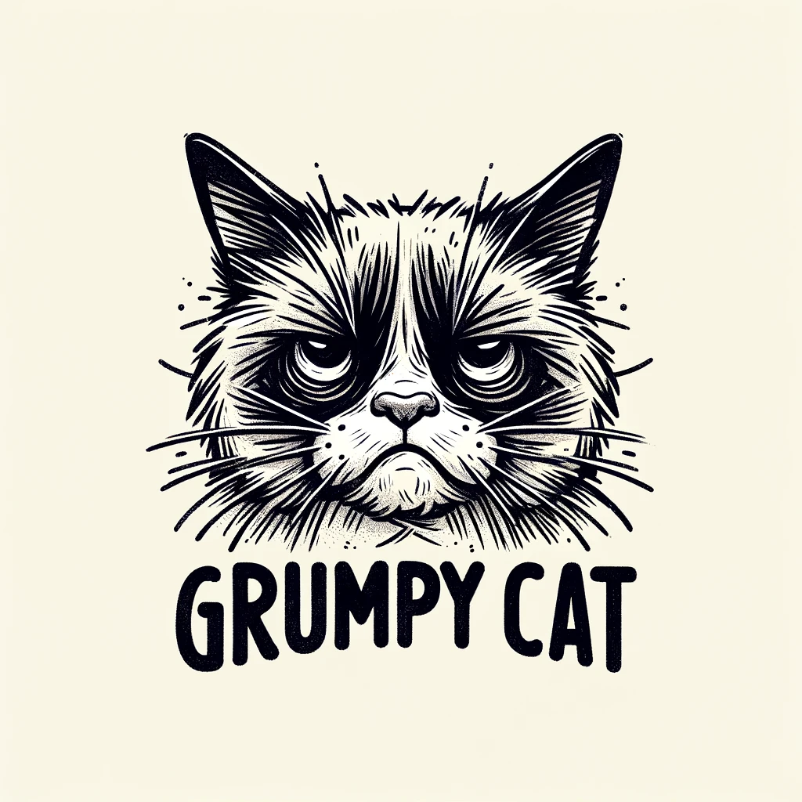

# The Grumpy Cat

Vous réaliserez la page d'accueil du bar nommé "The Grumpy Cat".

L'établissement organise des concerts et à besoin de communiquer sur ces événements depuis sa page d'accueil.

Sur la même page, la carte des boissons devra être visible.

Une section commentaires/avis devra aussi s'y trouver.

La section s'occupant des concerts, comportera des illustrations et sera organisé en liste, faite en sort que les images soivent optimisé.

Tout devra se trouver en une seulement page.

Une bare de navagition devra être présente (les liens seront des ancres vers les divers sections de la page).

Vous pouvez vous inspirer de cette maquette :  
https://www.figma.com/file/mDIUYxnMvtUb7u5RqAGRld/The-Grumpy-Cat?type=design&node-id=0%3A1&mode=design&t=RO6PUb5GNNfUWtLB-1

Pour ce qui est des polices d'écriture sur la maquette, on utilise **DM Mono** et **Inria Serif** qui sont des police google font.

Et pour les couleurs :
- #FFFFFF
- #000000
- #F9F5E6
- #242424
- #F6D453